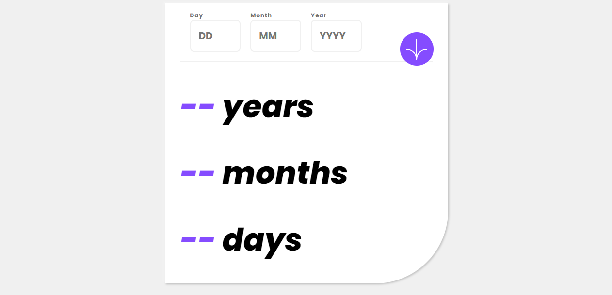

# Frontend Mentor - Age calculator app solution

This is a solution to the [Age calculator app challenge on Frontend Mentor](https://www.frontendmentor.io/challenges/age-calculator-app-dF9DFFpj-Q). Frontend Mentor challenges help you improve your coding skills by building realistic projects.

## Table of contents

- [Overview](#overview)
  - [The challenge](#the-challenge)
  - [Screenshot](#screenshot)
  - [Links](#links)
- [My process](#my-process)
  - [Built with](#built-with)
  - [What I learned](#what-i-learned)
  - [Continued development](#continued-development)
  - [Useful resources](#useful-resources)
- [Author](#author)

**Note: Delete this note and update the table of contents based on what sections you keep.**

## Overview

### The challenge

Users should be able to:

- View an age in years, months, and days after submitting a valid date through the form
- Receive validation errors if:
  - Any field is empty when the form is submitted
  - The day number is not between 1-31
  - The month number is not between 1-12
  - The year is in the future
  - The date is invalid e.g. 31/04/1991 (there are 30 days in April)
- View the optimal layout for the interface depending on their device's screen size
- See hover and focus states for all interactive elements on the page
- **Bonus**: See the age numbers animate to their final number when the form is submitted

### Screenshot



### Links

- Solution URL: (https://github.com/Repo1206/age-calculator-apphttps://github.com/Repo1206/age-calculator-app)
- Live Site URL: [Add live site URL here](https://your-live-site-url.com)

## My process

### Built with

- Semantic HTML5 markup
- CSS custom properties
- Flexbox
- CSS flex

### What I learned

These lines of code showcase my ability to handle errors, perform date calculations, and create visually appealing designs. They demonstrate my understanding of JavaScript logic, CSS styling, and application development.

```js
let dateOfBirth = new Date(birthday);
let ageDifference = Date.now() - dateOfBirth.getTime();
let ageDate = new Date(ageDifference);
let ageDay = ageDate.getUTCDate();
let ageMonth = ageDate.getUTCMonth();
let ageYears = ageDate.getUTCFullYear() - 1970;

outputDay.textContent = ageDay;
outputMonth.textContent = ageMonth;
outputYear.textContent = ageYears;
```

```css
.container {
  background-color: var(--white);
  width: 32.5rem;
  max-width: 80%;
  padding: 1rem 2rem 0 2rem;
  position: relative;
  border-bottom-right-radius: 9.375rem;
  box-shadow: 2px 2px 4px rgba(0, 0, 0, 0.2), -2px -2px 4px rgba(255, 255, 255, 0.4);
}
```

```js
if (+inputDay.value > 31) {
  errorDay.textContent = "Must Be A Valid Day";
  isValid = false;
  return;
} else {
  isValid = true;
  errorDay.textContent = " ";
}
```

### Continued development

Error handling and user input validation are the two main areas I wish to concentrate on. It's crucial for my code to smoothly handle various situations and give users helpful error messages.

CSS Styling and Layout: I want to hone my CSS abilities so I can make designs that are both aesthetically pleasing and responsive. I'll practice building complex layouts with the right spacing, alignment, and responsiveness while investigating various layout strategies like flexbox and grid.

Date Manipulation in JavaScript: I'm now interested to learn more about JavaScript date manipulation. Learning multiple date systems, the handling of timezones, and the dealing with various date formats.

Refactoring and Code Organization: I'm dedicated to making my code more readable, maintainable, and reusable. By dissecting, I'll test my refactoring skills.

### Useful resources

- [resource 1](https://www.w3schools.com/JSREF/jsref_getutcdate.asp) - I learned that this method is used to retrieve the day of the month in UTC (Coordinated Universal Time) format from a Date object. It returns an integer value representing the day of the month (from 1 to 31).

## Author

- Website - [Phillip](https://personal-site-puce-three.vercel.app/)
- Frontend Mentor - [@Repo1206](https://www.frontendmentor.io/profile/Repo1206)
- Twitter - [@Phillip_Estes20](https://twitter.com/Phillip_Estes20)
